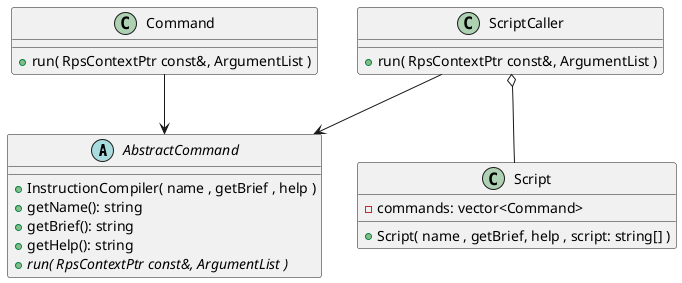
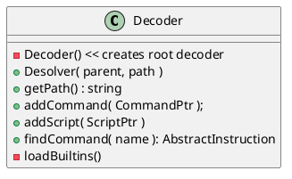

# RPN CLI

librps implements a CLI engine inspired by reverse polish notation with some
(limited) scripting capabilities.

In addition to builtin instructions, the library can be extended with
additional commands.

The CLI has a notion of working directory simmilar to the filesystem structure
of most operating systems. The working directory is used to resolve commands
into the corresponding instruction.

When looking up a command, the following sequence is followed:
* lookup command on working path
* if a command wasn't found, lookup in the parent path
* repeat lookup on parent, if needed, until lookup path reaches root
* If the command is not found on root, an exception is thrown

# CLI Session

The CLI session is an abstract class that provides:
* Decoder
* working path
* RPN Stack

The session needs to be extended by the application to inject application
specific context which may be needed for proper operation of add-on commands

By extending the session, the application adds:
* an observer which is notified each time the working path changes
* any additional data that may be required by custom commands

## The default CLI Session

For applications where a custom session is not required, the DefaultRpsSession
may be used. This class, accepts an external observer that will be invoked on
changes of the working path

## usage of context for command execution

Commands may or may not use the RPN Stack. Examples of commands that do not
use the stack are:
* help
* exit

Commands that use the stack are usually related to I/O or math. Some examples
are:
* add
* mul
* sub
* div

# Instruction Abstraction Model

Instructions may take two forms:
* **SingleInstruction**: usually has the form `instr [args...]`
* **Script**: can only be invoked as `scr_name` and accepts no arguments.
  Any parameters must be passed on the context (stack and/or stored variables)

Instructions and Scripts **MUST** be tread-safe.

### RunnableInstruction
A *RunnableInstruction* is an optimized version of an instruction which may
be used to speed up execution. A compiled instruction is thread-safe and 
reentrant. Its arguments remain unchanged after compilation, therefore only
the *RpsSession* is needed for actual execution.

A trivial compiled instruction saves the arguments and simply invoker
SingleInstruction::run() when invoked. Whenever deemed necessary, 
instructions may chose to implement an optimized compiled form.

### SingleInstruction
A *SingleInstruction* may be compiled, using a certain set of arguments, into
a RunnableInstruction. Alternatively, it can also be executed directly, using
any given RpsContext and number of arguments.

### Script
A Script groups together a number of instructions. It compiles each
instruction into a *RunnableInstruction* and stores the resulting list for
faster execution.

Scripts do not support arguments when invoked. This may change in future
 versions.

# RpsResolver

 

